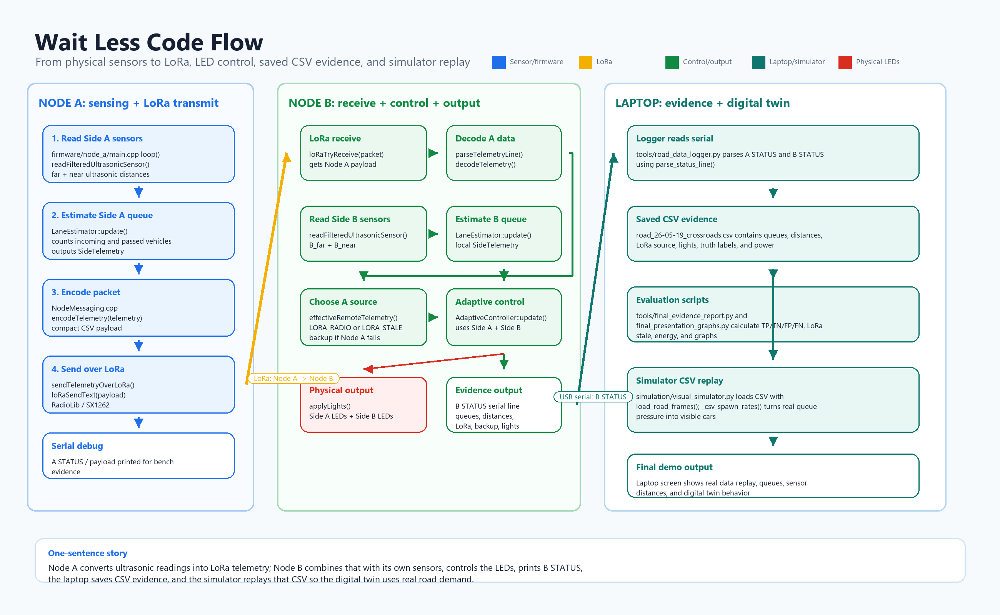
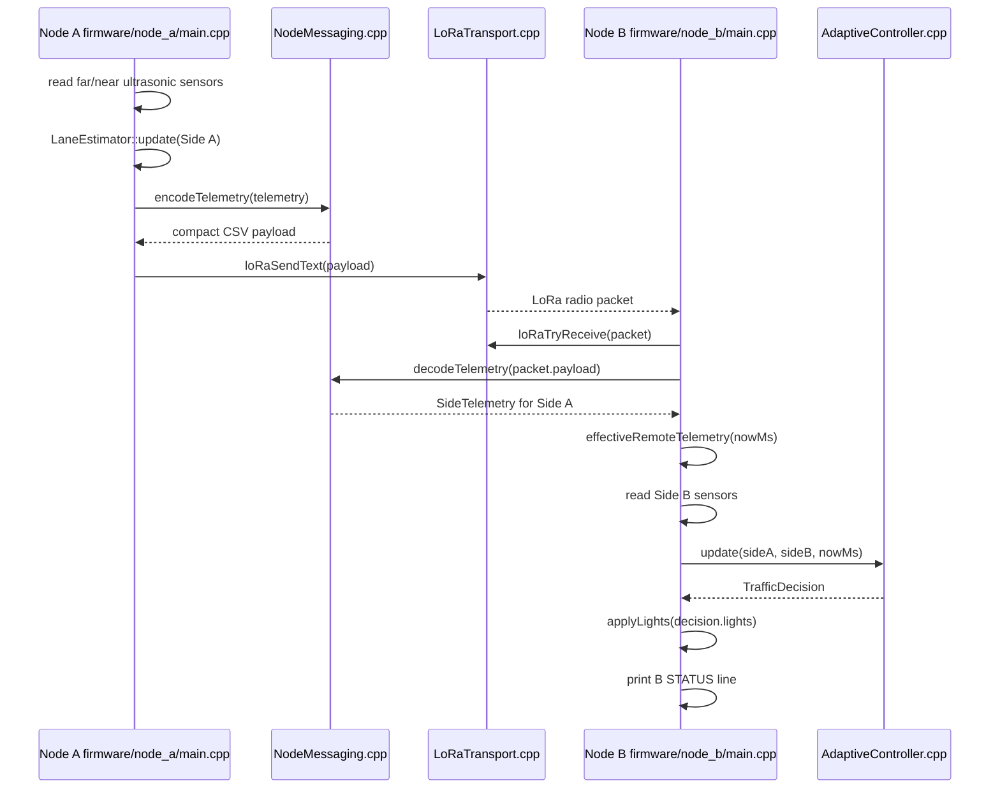
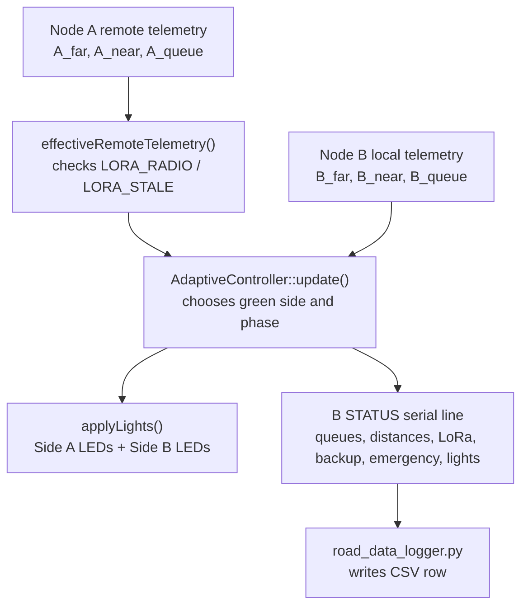
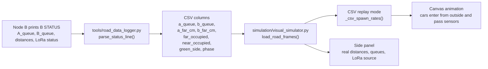
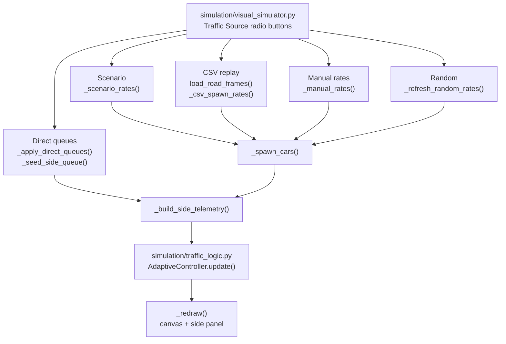

# Wait Less Code Flow Diagram

This document explains what code calls what, where each output goes, where LoRa is transmitted/received, and how the real output becomes simulator input.

## PPT Image

Use this ready-made PNG in the presentation:

## 1. Full System Code Flow

```mermaid
flowchart LR
  subgraph node_a["Firmware: Node A sensing node"]
    ASetup["firmware/node_a/main.cpp\nsetup()"]
    ALoop["firmware/node_a/main.cpp\nloop()"]
    ASensors["readFilteredUltrasonicSensor()\nSensorSupport.cpp"]
    AEstimator["LaneEstimator::update()\nTrafficSensing.cpp"]
    AEncode["encodeTelemetry()\nNodeMessaging.cpp"]
    ALoRaTx["sendTelemetryOverLoRa()\nloRaSendText()\nLoRaTransport.cpp"]
    ASerial["Serial output\nA STATUS / payload"]
  end

  subgraph node_b["Firmware: Node B controller node"]
    BSetup["firmware/node_b/main.cpp\nsetup()"]
    BLoop["firmware/node_b/main.cpp\nloop()"]
    BLoRaRx["loRaTryReceive()\nLoRaTransport.cpp"]
    BDecode["parseTelemetryLine()\ndecodeTelemetry()\nNodeMessaging.cpp"]
    BSensors["readFilteredUltrasonicSensor()\nSensorSupport.cpp"]
    BEstimator["LaneEstimator::update()\nTrafficSensing.cpp"]
    BRemote["effectiveRemoteTelemetry()\nLORA_RADIO / LORA_STALE / backup"]
    BControl["AdaptiveController::update()\nAdaptiveController.cpp"]
    BLights["applyLights()\nGPIO LED outputs"]
    BSerial["Serial output\nB STATUS live evidence line"]
  end

  subgraph pc["Laptop tools"]
    Logger["tools/road_data_logger.py\nparse_status_line()"]
    CSV["Saved road CSV\nroad_26-05-19_crossroads.csv"]
    Evidence["tools/final_evidence_report.py\ntools/final_presentation_graphs.py"]
    Sim["simulation/visual_simulator.py\nCSV replay / Direct queues / Random"]
  end

  ASetup --> ALoop
  ALoop --> ASensors
  ASensors --> AEstimator
  AEstimator --> AEncode
  AEncode --> ALoRaTx
  ALoop --> ASerial

  ALoRaTx -- "LoRa packet: Side A queue, sensors, distances" --> BLoRaRx

  BSetup --> BLoop
  BLoop --> BLoRaRx
  BLoRaRx --> BDecode
  BDecode --> BRemote
  BLoop --> BSensors
  BSensors --> BEstimator
  BEstimator --> BControl
  BRemote --> BControl
  BControl --> BLights
  BControl --> BSerial

  ASerial --> Logger
  BSerial --> Logger
  Logger --> CSV
  CSV --> Evidence
  CSV --> Sim
```

## 2. LoRa Path: Who Sends And Who Receives

The important LoRa points:

- **Transmit side:** `firmware/node_a/main.cpp`
  - `encodeTelemetry(telemetry)` creates the compact packet.
  - `sendTelemetryOverLoRa(payload)` calls `loRaSendText(payload, Serial)`.

- **Receive side:** `firmware/node_b/main.cpp`
  - `loRaTryReceive(packet, Serial)` checks for a new radio packet.
  - `parseTelemetryLine(packet.payload, receivedTelemetry)` decodes Node A data.
  - `effectiveRemoteTelemetry(nowMs)` decides whether Node B uses live LoRa data or backup data.

## 3. Node B Output: Lights And Evidence Log

Node B has two output types:

| Output | Code location | Meaning |
| --- | --- | --- |
| Traffic-light GPIO output | `applyLights()` in `firmware/node_b/main.cpp` | Physical LEDs for Side A and Side B |
| Live evidence log | `B STATUS` in `firmware/node_b/main.cpp` | Human-readable serial line for the laptop demo |
| CSV evidence | `parse_status_line()` in `tools/road_data_logger.py` | Saved data for validation, graphs, and simulator replay |

## 4. How The Real Output Enters The Simulator

In the final simulator:

- `CSV replay` mode loads the road CSV directly inside `simulation/visual_simulator.py`.
- `load_road_frames()` pairs the latest Node A row with the latest Node B row.
- `_csv_spawn_rates()` converts real queue pressure into visible car generation.
- The cars are still simulated visually, but the pressure comes from the real road data.
- The side panel shows real sensor distances and LoRa source from the CSV.

## 5. Simulator Modes And Their Code Path

Use this explanation in the presentation:

> The simulator has several modes because it was used during different development stages. For the final demo, `CSV replay` is the digital twin mode: it uses the real road CSV. `Direct queues` is for explaining the controller interactively. `Random` and `Scenario` are older synthetic traffic sources used for early testing.

## 6. Field-To-Simulator Mapping

| Real firmware/log field | CSV field | Simulator use |
| --- | --- | --- |
| `A_queue` from Node A LoRa telemetry | `a_queue` / `remote_queue` | Real Side A traffic pressure |
| `B_queue` from Node B local sensors | `b_queue` / `local_queue` | Real Side B traffic pressure |
| `A_far`, `A_near` | `a_far_cm`, `a_near_cm`, occupied flags | Display real Side A sensor state |
| `B_far`, `B_near` | `b_far_cm`, `b_near_cm`, occupied flags | Display real Side B sensor state |
| `source=LORA_RADIO` / `LORA_STALE` | `remote_source`, `remote_stale` | Show whether Node A data was live or stale |
| `green`, `phase` | `green_side`, `phase` | Compare firmware state with simulator controller state |
| truth labels typed during logging | `truth_any_vehicle`, `truth_far`, `truth_near` | Calculate TP/TN/FP/FN and accuracy |

## 7. One-Sentence Code Story

Node A converts physical ultrasonic readings into compact LoRa telemetry, Node B receives that telemetry and combines it with its own sensors to control the LEDs, the laptop logger saves Node B's live evidence line into CSV, and the simulator replays that CSV so the digital twin uses real road demand instead of invented traffic.
