# Wait Less: Building An IoT Adaptive Traffic-Light Prototype With ESP32, LoRa, And Real Road Data

**Subtitle:** A university IoT project that connects real ultrasonic sensors, ESP32 firmware, LoRa telemetry, adaptive control, CSV evidence, energy measurements, and a digital-twin replay.

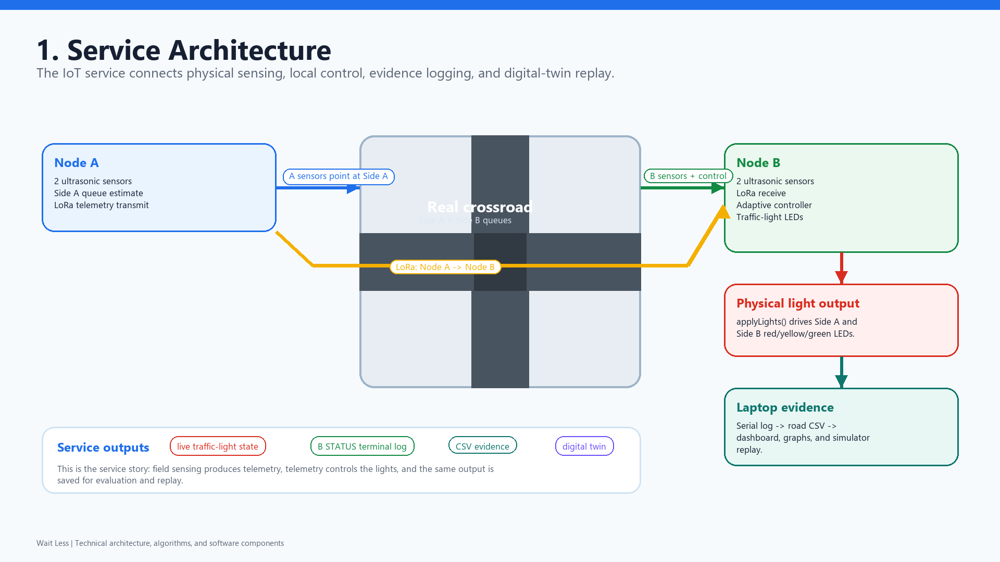

## Overview

Wait Less is an IoT adaptive traffic-light prototype for a two-way crossroad. The project uses real sensors and real measurements instead of relying only on a simulation.

The main system path is:

```text
real sensors -> ESP32 firmware -> LoRa telemetry -> traffic-light control -> CSV evidence -> evaluation -> simulator replay
```

The prototype is intentionally small, but the architecture follows the same questions a larger traffic system would need to answer:

- How do we detect vehicles reliably with low-cost sensors?
- How do two road-side nodes communicate?
- How does the controller decide which side gets green?
- How do we prove the system works with measured data?
- How much energy does the wireless node consume?
- What are the limits of the design?

## Hardware Architecture

The system uses two ESP32 Heltec WiFi LoRa 32 V3 boards.

| Node | Role |
| --- | --- |
| Node A | Reads Side A ultrasonic sensors and sends Side A telemetry over LoRa |
| Node B | Reads Side B ultrasonic sensors, receives Side A telemetry, runs the controller, and drives both traffic lights |

Each road side has two HC-SR04 ultrasonic sensors:

- **Far sensor:** detects approaching vehicles.
- **Near sensor:** detects stop-line or queue presence.

The hardware used in the prototype:

- 2 x ESP32 Heltec WiFi LoRa 32 V3 boards
- 4 x HC-SR04 ultrasonic sensors
- 6 x LEDs for two traffic lights
- 1 x push button for emergency priority testing
- 1 x INA219 current sensor for power measurements
- LoRa link between Node A and Node B

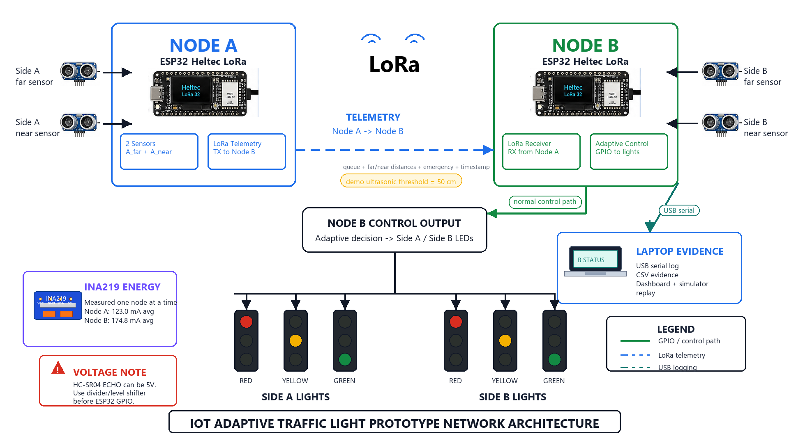

## Vehicle Detection Logic

The firmware does not measure speed directly. It detects whether a vehicle is present inside the ultrasonic detection zone.

The sensing pipeline is:

```text
HC-SR04 distance reading
-> median-of-3 filter
-> distance threshold
-> 2-sample debounce
-> stable occupied/free state
-> queue estimator
```

The main firmware loop runs every `200 ms`, so each sensor produces a filtered occupancy update at about `5 Hz`. The debounce requires `2` consistent readings before the occupied/free state changes.

That gives a conservative detection time of:

```text
2 x 200 ms = 400 ms = 0.4 s
```

For an urban road, we can estimate what car speed this supports. A normal car passing a side-looking ultrasonic beam stays detectable for roughly its body length plus the beam width:

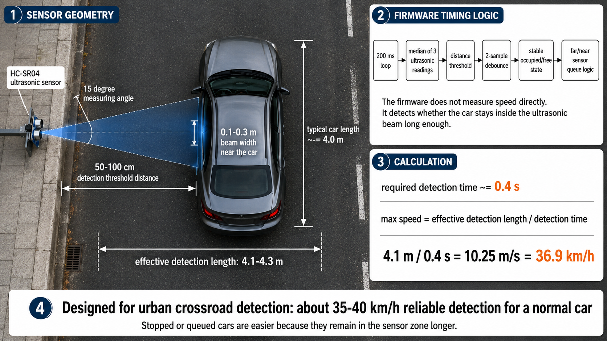

```text
typical car length ~= 4.0 m
beam width at 50-100 cm ~= 0.1-0.3 m
effective detection length ~= 4.1-4.3 m

safe speed ~= 4.1 m / 0.4 s
           ~= 10.25 m/s
           ~= 36.9 km/h
```

So the honest claim is that the prototype is suitable for **urban crossroad and queue detection**, around **35-40 km/h reliable detection** for a normal car. Stopped or queued cars are easier because they remain in the sensor zone much longer.

## Why 50 cm And 100 cm Thresholds?

The project uses two practical threshold settings:

| Context | Threshold |
| --- | ---: |
| Live demo | `50 cm / 50 cm` |
| Road evaluation | `100 cm / 100 cm` |

The HC-SR04 sensor is typically specified for about `2-400 cm`, so both thresholds are comfortably inside its operating range.

The design tradeoff is simple:

- A **larger threshold** catches more vehicles, but it can also detect pedestrians, curbs, poles, or other unwanted reflections.
- A **smaller threshold** reduces false positives, but it can miss vehicles if the sensor angle or mounting is not ideal.

For the live demo, `50 cm` makes triggering more controlled indoors. For the real road evaluation, `100 cm` gives a wider detection zone for real cars.

For a deployment, we would not use one universal value. We would calibrate the far and near sensors separately after mounting them on the actual road.

## Queue Estimation

The firmware converts sensor occupancy into simple vehicle counters:

- a far-sensor rising edge means a vehicle entered the measured lane
- a near-sensor falling edge means a vehicle passed the stop-line area

The queue estimate is:

```text
estimated_queue = incoming_count - passed_count
```

If a car is sitting on the near sensor and the counters are still zero, the firmware reports at least one queued vehicle so the controller can react.

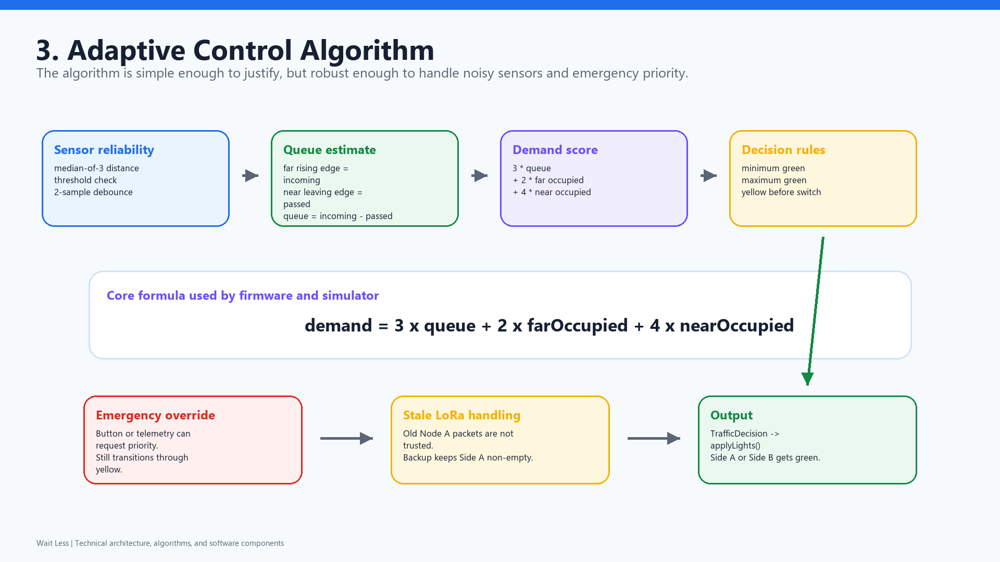

## Adaptive Control

Node B combines local Side B data with remote Side A data and computes a demand score:

```text
demand = 3 x estimated_queue + 2 x far_occupied + 4 x near_occupied
```

The near sensor has a larger weight because it means a vehicle is already at the stop line.

The controller uses:

| Setting | Value |
| --- | ---: |
| Minimum green time | `5 s` |
| Maximum green time | `20 s` |
| Yellow transition | `2 s` |
| Advantage margin | `4 demand points` |

The advantage margin prevents rapid switching when both sides have similar demand.

## LoRa Communication

The project uses compact CSV-style LoRa payloads.

Example telemetry packet:

```text
A,1,0,4,2,2,0,12345,42.0,999.0
```

Example heartbeat packets:

```text
H,A,I,12345
H,A,P,12345
```

The heartbeat design matters because it separates two different situations:

- "Node A is alive, but there is no useful traffic update."
- "Node A is missing or stale."

The configured LoRa settings are:

| Setting | Value |
| --- | ---: |
| Frequency | `868 MHz` |
| Bandwidth | `125 kHz` |
| Spreading factor | `SF7` |
| Coding rate | `4/5` |
| Output power | `14 dBm` |

Estimated radio airtime:

| Packet | Estimated airtime |
| --- | ---: |
| Heartbeat | about `41 ms` |
| Full telemetry | about `72-82 ms` |

The practical control latency is dominated more by firmware scheduling than radio airtime. Node A senses every `200 ms` and normally sends active telemetry every `1 s`, so remote-side reaction is typically around `0.8-1.0 s`, with a conservative worst case around `1.5 s`.

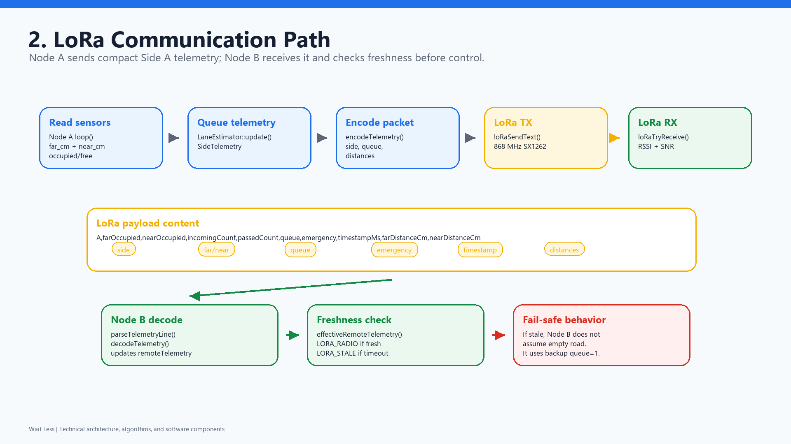

## Real Road Evaluation

We collected and manually labelled a real road session, then evaluated the saved CSV.

Dataset summary:

```text
duration: 18.0 minutes
samples: 2160
thresholds: 100 cm / 100 cm
```

Detection results:

```text
true positives: 1269
true negatives: 817
false positives: 59
false negatives: 15

accuracy: 96.6%
false positive rate: 6.7%
false negative rate: 1.2%
LoRa stale rows: 65 / 2160 = 3.0%
```

In this project:

- A **false positive** means the sensor said "vehicle present", but the manual label said no vehicle.
- A **false negative** means the manual label said "vehicle present", but the sensors did not detect it.

False positives can happen because ultrasonic sensors detect physical objects, not object class. A pedestrian, road edge, pole, bad angle, or reflection can be detected as a vehicle.

False negatives can happen if the car passes too quickly, is outside the cone, reflects poorly, or appears for too short a time to survive the filter and debounce.

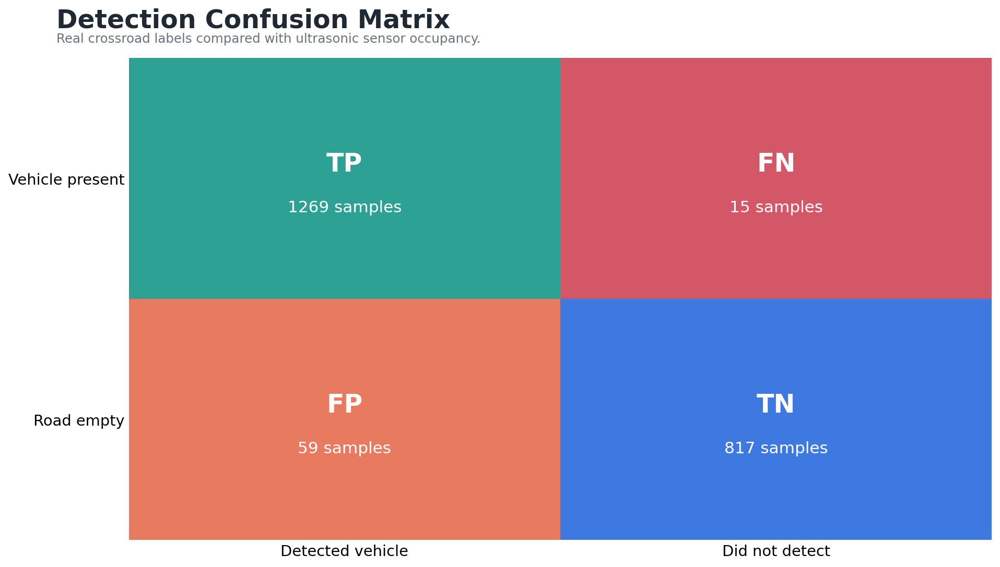

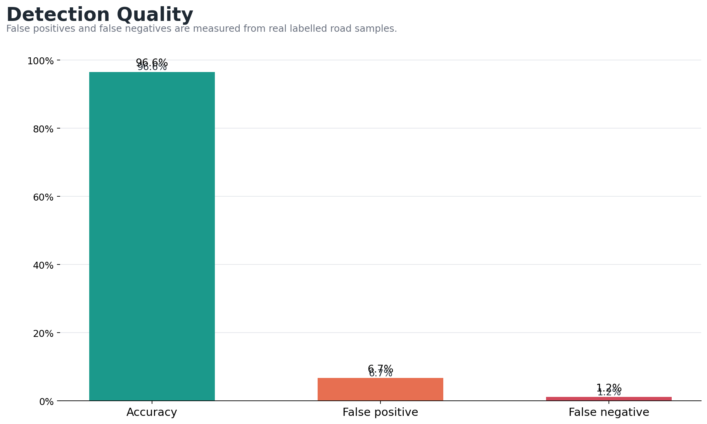

## Firmware Improvement From Field Data

The first version used a simpler sensor state:

```text
median1_debounce1
```

After field testing, we added:

```text
median3_debounce2
```

The comparison used the same sensor placement and `100 cm / 100 cm` thresholds.

| Metric | Before | After |
| --- | ---: | ---: |
| Duration | 600 s | 600 s |
| Accuracy | 94.2% | 98.2% |
| False positives | 27 | 9 |
| False negatives | 8 | 2 |
| Noise/ghost false positives | 13 | 0 |
| LoRa stale samples | 5 | 2 |
| Occupancy state changes | 46 | 28 |

The median filter removed one-sample ultrasonic spikes. The debounce made the occupied/free state more stable. The important lesson was that the first demo version was not enough: labelled data showed exactly where the firmware needed improvement.

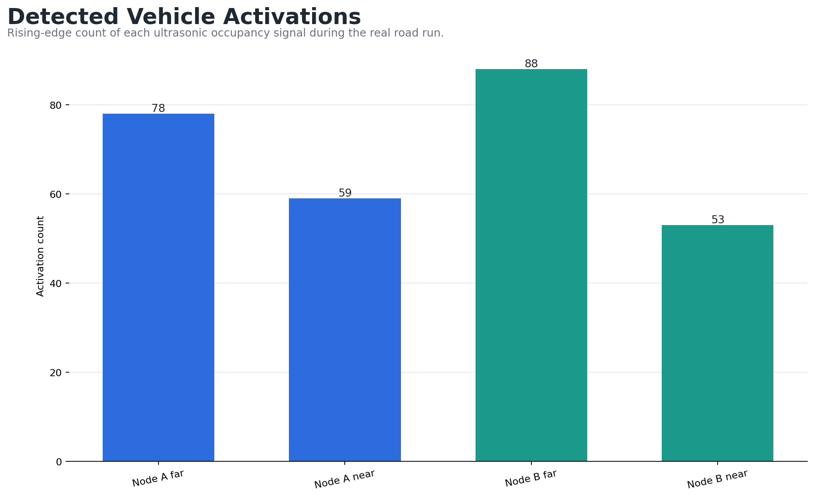

## Energy Measurements

We measured power with an INA219 current sensor.

Baseline:

| Node | Average current | Average power |
| --- | ---: | ---: |
| Node A | `121.4 mA` | `609.4 mW` |
| Node B | `174.8 mA` | `875.7 mW` |

After adding heartbeat and low-communication modes:

| Mode | Average current | Average power | Reduction |
| --- | ---: | ---: | ---: |
| Node A active telemetry | `118.7 mA` | `595.9 mW` | `2.2%` |
| Node A idle heartbeat | `74.6 mA` | `375.2 mW` | `38.6%` |
| Node A peak sleep | `32.8 mA` | `164.3 mW` | `73.0%` |
| Node B telemetry receive | `172.9 mA` | `866.2 mW` | `1.1%` |
| Node B heartbeat receive | `158.4 mA` | `795.2 mW` | `9.4%` |

Node A benefits more because it can reduce repeated LoRa communication and sleep during peak-mode operation. Node B stays mostly awake because it controls the lights.

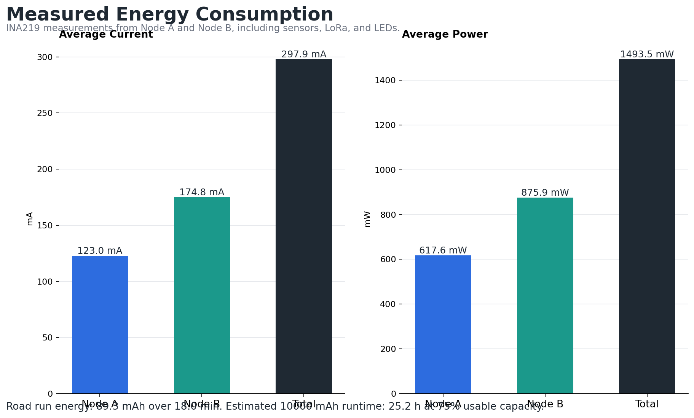

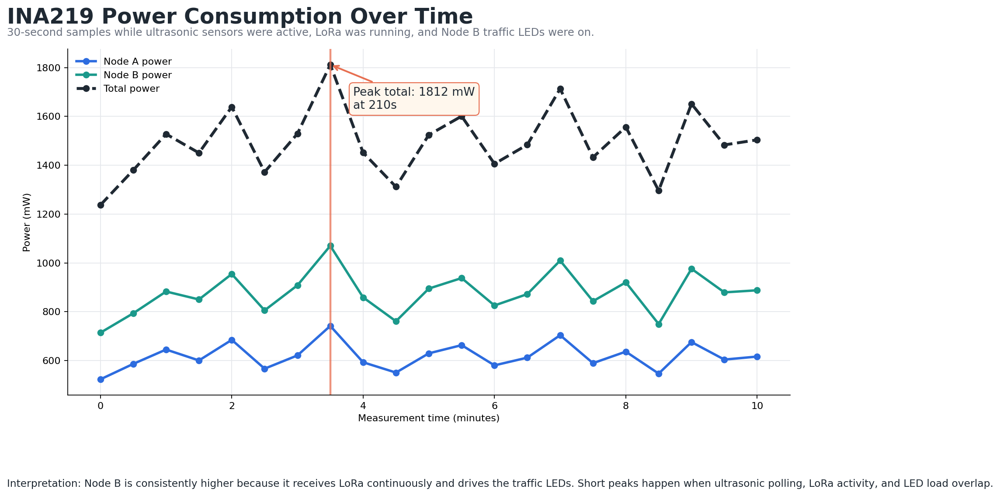

## Digital Twin Replay

The simulator can run random traffic, manual queue inputs, or replay the real CSV data.

The replay flow is:

```text
road CSV -> queue estimates -> visual cars -> traffic-light decisions
```

This is not meant to replace real sensing. It gives a visible explanation of what the logged data and controller are doing.

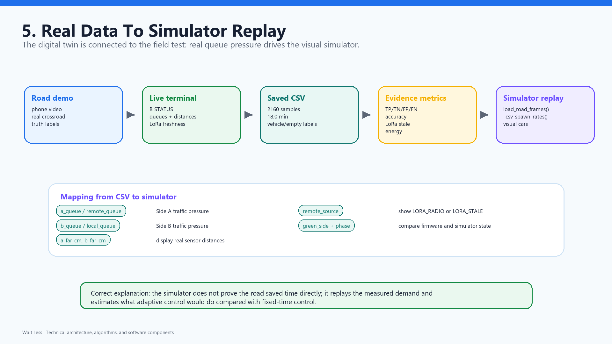

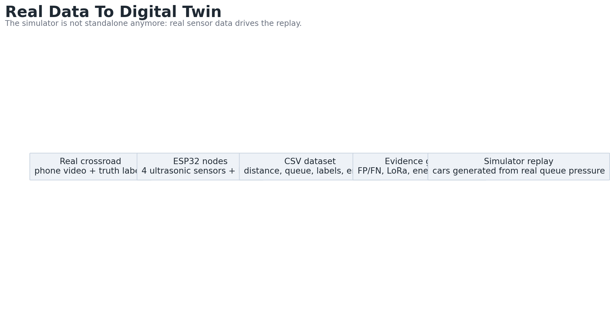

## What We Would Improve Next

The current prototype works as a measured university IoT system, but it is not a production traffic controller. The next improvements would be:

- Calibrate each far and near sensor separately after installation.
- Mount the sensors more rigidly and tune the angle for each lane.
- Add an upstream sensor for faster roads.
- Test radar or magnetometer sensing to reduce pedestrian false positives.
- Add synchronized timestamps to measure exact LoRa end-to-end latency.
- Collect a longer dataset across different traffic, weather, and lighting conditions.
- Learn threshold and demand weights from labelled data instead of fixing them manually.

## Main Takeaway

The biggest lesson was that embedded logic is only half of the project. The other half is measurement.

The system became much stronger after we stopped treating the demo as proof and started logging real data. Median filtering, debounce, stale-node handling, heartbeat packets, energy modes, and the simulator replay all came from trying to make the prototype explainable with numbers.

Wait Less is still a prototype, but it demonstrates a full IoT loop:

```text
physical sensing
-> wireless telemetry
-> adaptive control
-> data logging
-> measured evaluation
-> visual replay
```

That is the part we are most satisfied with: not only that the LEDs change, but that the system can defend its choices with real measurements.
